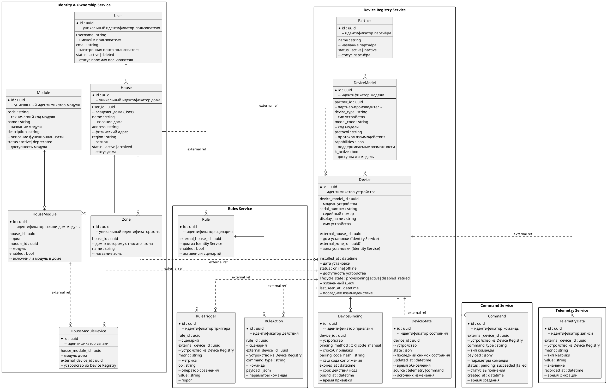

```puml
@startuml
hide circle
skinparam linetype ortho
skinparam shadowing false
skinparam packageStyle rectangle

' ==========================================================
' Legend:
'   - Solid line: внутри одного сервиса (возможен FK)
'   - Dotted line "..": связь через границу сервиса (external ref)
'   - external_* поля: id сущности из другого сервиса
' ==========================================================

package "Identity & Ownership Service" as ID {
  entity "User" as user {
    * id : uuid
      -- уникальный идентификатор пользователя
    --
    username : string
      -- никнейм пользователя
    email : string
      -- электронная почта пользователя
    status : active|deleted
      -- статус профиля пользователя
  }

  entity "House" as house {
    * id : uuid
      -- уникальный идентификатор дома
    --
    user_id : uuid
      -- владелец дома (User)
    name : string
      -- название дома
    address : string
      -- физический адрес
    region : string
      -- регион
    status : active|archived
      -- статус дома
  }

  entity "Zone" as zone {
    * id : uuid
      -- уникальный идентификатор зоны
    --
    house_id : uuid
      -- дом, к которому относится зона
    name : string
      -- название зоны
  }

  entity "Module" as module {
    * id : uuid
      -- уникальный идентификатор модуля
    --
    code : string
      -- технический код модуля
    name : string
      -- название модуля
    description : string
      -- описание функциональности
    status : active|deprecated
      -- доступность модуля
  }

  entity "HouseModule" as house_module {
    * id : uuid
      -- идентификатор связки дом–модуль
    --
    house_id : uuid
      -- дом
    module_id : uuid
      -- модуль
    enabled : bool
      -- включён ли модуль в доме
  }

  entity "HouseModuleDevice" as hmd {
    * id : uuid
      -- идентификатор связки
    --
    house_module_id : uuid
      -- модуль дома
    external_device_id : uuid
      -- устройство из Device Registry
  }
}

package "Device Registry Service" as DR {
  entity "Partner" as partner {
    * id : uuid
      -- идентификатор партнёра
    --
    name : string
      -- название партнёра
    status : active|inactive
      -- статус партнёра
  }

  entity "DeviceModel" as device_model {
    * id : uuid
      -- идентификатор модели
    --
    partner_id : uuid
      -- партнёр-производитель
    device_type : string
      -- тип устройства
    model_code : string
      -- код модели
    protocol : string
      -- протокол взаимодействия
    capabilities : json
      -- поддерживаемые возможности
    is_active : bool
      -- доступна ли модель
  }

  entity "Device" as device {
    * id : uuid
      -- идентификатор устройства
    --
    device_model_id : uuid
      -- модель устройства
    serial_number : string
      -- серийный номер
    display_name : string
      -- имя устройства

    external_house_id : uuid
      -- дом установки (Identity Service)
    external_zone_id : uuid?
      -- зона установки (Identity Service)

    installed_at : datetime
      -- дата установки
    status : online|offline
      -- доступность устройства
    lifecycle_state : provisioning|active|disabled|retired
      -- жизненный цикл
    last_seen_at : datetime
      -- последнее взаимодействие
  }

  entity "DeviceBinding" as binding {
    * id : uuid
      -- идентификатор привязки
    --
    device_id : uuid
      -- устройство
    binding_method : QR|code|manual
      -- способ привязки
    pairing_code_hash : string
      -- хэш кода сопряжения
    expires_at : datetime
      -- срок действия кода
    bound_at : datetime
      -- время привязки
  }

  entity "DeviceState" as state {
    * id : uuid
      -- идентификатор состояния
    --
    device_id : uuid
      -- устройство
    state : json
      -- последний снимок состояния
    updated_at : datetime
      -- время обновления
    source : telemetry|command
      -- источник изменения
  }
}

package "Command Service" as CS {
  entity "Command" as command {
    * id : uuid
      -- идентификатор команды
    --
    external_device_id : uuid
      -- устройство из Device Registry
    command_type : string
      -- тип команды
    payload : json?
      -- параметры команды
    status : pending|succeeded|failed
      -- статус выполнения
    created_at : datetime
      -- время создания
  }
}

package "Telemetry Service" as TS {
  entity "TelemetryData" as telemetry {
    * id : uuid
      -- идентификатор записи
    --
    external_device_id : uuid
      -- устройство из Device Registry
    metric : string
      -- тип метрики
    value : string
      -- значение
    recorded_at : datetime
      -- время фиксации
  }
}

package "Rules Service" as RS {
  entity "Rule" as rule {
    * id : uuid
      -- идентификатор сценария
    --
    external_house_id : uuid
      -- дом из Identity Service
    enabled : bool
      -- активен ли сценарий
  }

  entity "RuleTrigger" as trigger {
    * id : uuid
      -- идентификатор триггера
    --
    rule_id : uuid
      -- сценарий
    external_device_id : uuid
      -- устройство из Device Registry
    metric : string
      -- метрика
    op : string
      -- оператор сравнения
    value : string
      -- порог
  }

  entity "RuleAction" as action {
    * id : uuid
      -- идентификатор действия
    --
    rule_id : uuid
      -- сценарий
    external_device_id : uuid
      -- устройство из Device Registry
    command_type : string
      -- команда
    payload : json?
      -- параметры команды
  }
}

' ======================
' Relationships (inside services)
' ======================
user  ||--o{ house
house ||--o{ zone

house ||--o{ house_module
module ||--o{ house_module

partner ||--o{ device_model
device_model ||--o{ device

device ||--o{ binding
device ||--|| state

rule ||--o{ trigger
rule ||--o{ action

' ======================
' Cross-service links (external ref)
' ======================
house_module ||..o{ hmd : external ref
device       ||..o{ hmd : external ref

house ||..o{ device : external ref
zone  ||..o{ device : external ref

device ||..o{ command   : external ref
device ||..o{ telemetry : external ref

house  ||..o{ rule    : external ref
device ||..o{ trigger : external ref
device ||..o{ action  : external ref

@enduml

```